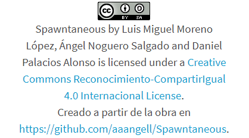

# Spawntaneous

Spawntaneous was developed as a final project for the Videogame Design and Development Degree by:

1. Luis Miguel Moreno Lopez: lm.moreno.2016@alumnos.urjc.es
2. Angel Noguero Salgado: a.noguero.2016@alumnos.urjc.es

Directed by: Daniel Palacios Alonso: daniel.palacios@urjc.es

Spawntaneous is a tool designed for helping devs with their spawning system.
This tool takes advantage of DOTS (Unity Technology).

